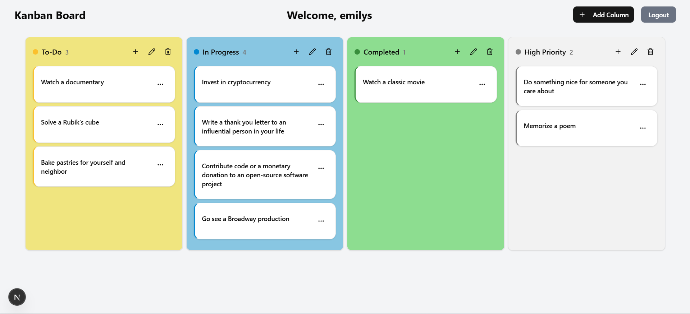
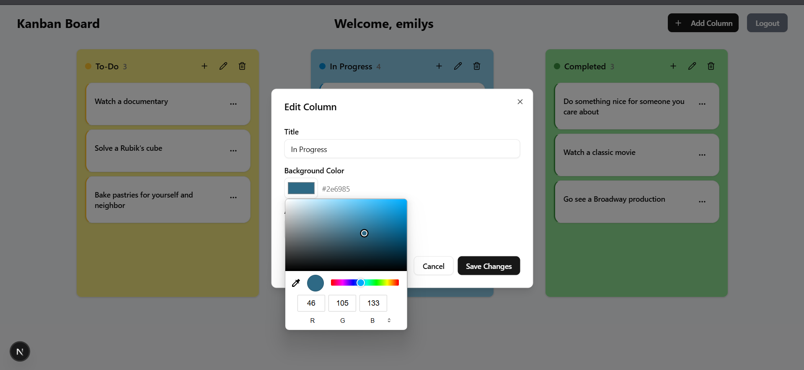
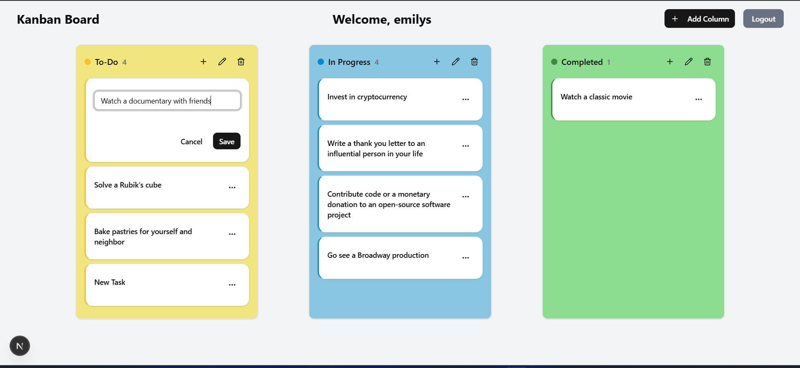
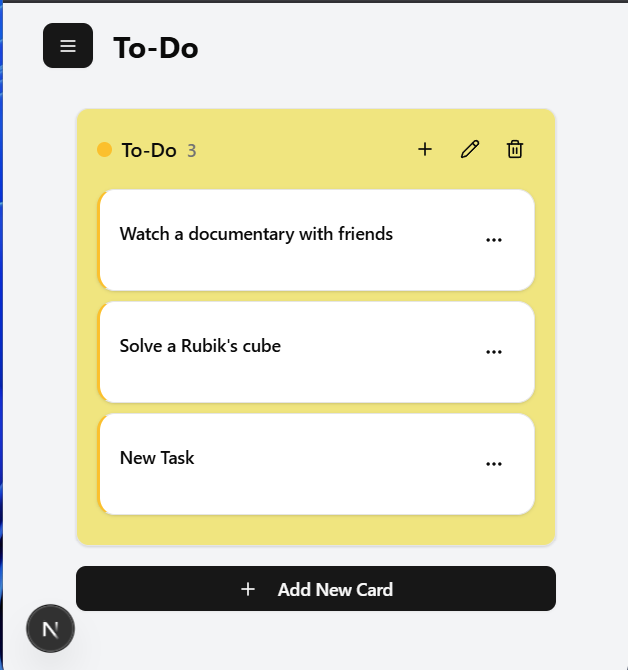
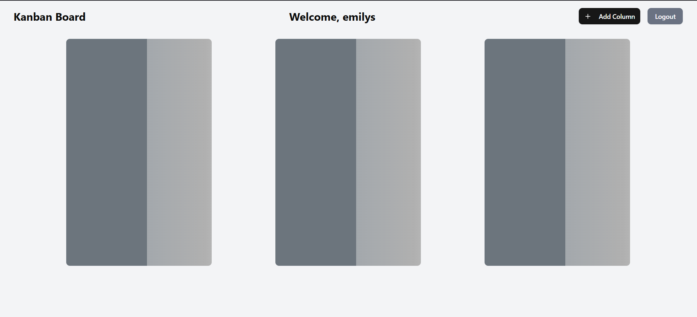
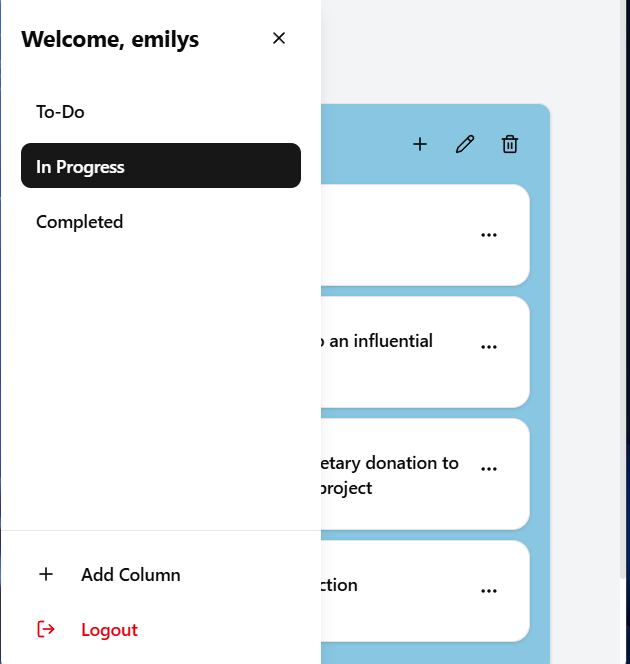
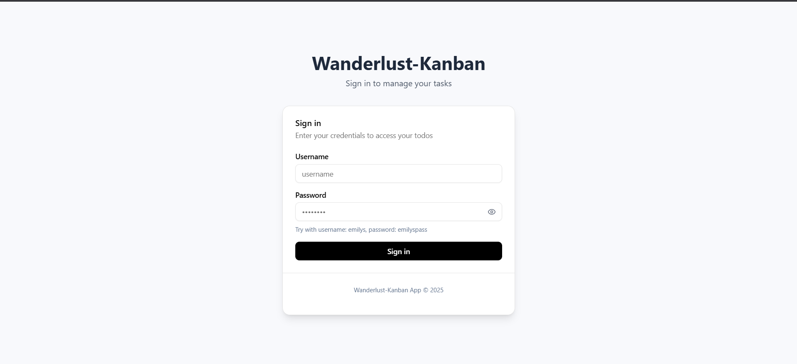
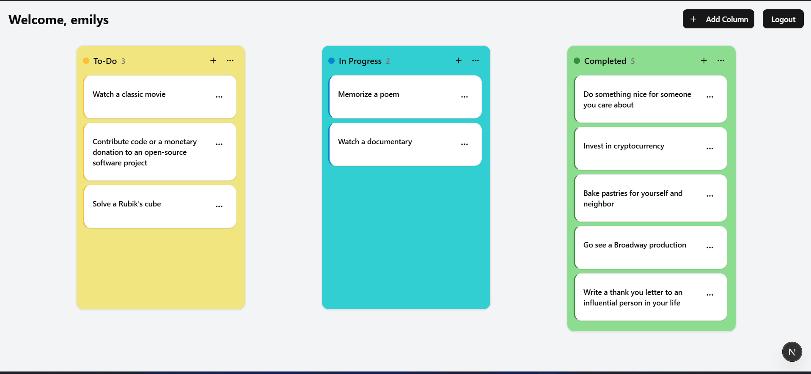

# 📝 Kanban Board App

A **Kanban Board Application** built using **Next.js**, designed to help manage tasks efficiently. This app allows users to create, edit, and organize tasks seamlessly within different columns.

---

## 🚀 Features

- 📝 **Task Management** – Add, edit, and delete tasks.
- 🏗️ **Customizable Columns** – Modify workflow stages as needed.
- 🎯 **Drag & Drop** – Rearrange tasks smoothly.
- 🔒 **User Authentication** – Secure login and session management.
- 📱 **Responsive UI** – Works on both desktop and mobile.
- ✨ **Shimmer Effect** – Enhances UX with smooth loading animations.
- 🎨 **Color Picker** – Customize board and task colors.

---

## 🛠️ Installation

1. **Clone this repository:**
   ```bash
   git clone https://github.com/your-username/kanban-board.git
   cd kanban-board
2. Install dependencies:
   ```bash
   npm install
   ```
3. Run the development server:
   ```bash
   npm run dev
   ```
4. Open your browser and visit `http://localhost:3000`.

---

## 📸 Screenshots

### 🟢 Add Column (`addColumn.png`)
_Add new workflow columns to organize tasks efficiently._



---

### 🎨 Color Picker (`colorpicker.png`)
_Choose custom colors for tasks and columns._



---

### ✏️ Edit Task (`edit_task.png`)
_Modify task details, including title, description, and status._



---

### 📱 Mobile UI (`mobileUI.png`)
_Responsive design ensures usability on mobile devices._



---

### ✨ Shimmer Effect (`Shimmer.png`)
_Loading animations for a smoother experience._



---

### 📂 Sidebar (`sidebar.png`)
_Navigation panel for switching between boards and settings._



---

### 🔑 Sign In (`signin.png`)
_User authentication to keep tasks private._



---

### 🌐 Web UI (`webUI.png`)
_Main Kanban board interface with drag-and-drop functionality._



---

## 📜 License
This project is **open-source** under the MIT License.

---

## 🤝 Contributing
Pull requests are welcome! Please open an issue first to discuss any changes.

---

## 📧 Contact
For any inquiries or support, feel free to reach out at `vishwasgupta.iitd@gmail.com`.
```


